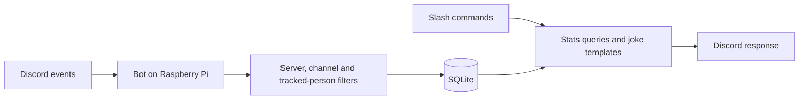

# Flock CCTV — behavior and design

The bot runs in one configured Discord server and tracks an admin-managed list
of people. The current implementation and validation notes are in
[REVIEW.md](REVIEW.md).

## Product

A Discord bot for a shared friend server that turns each tracked person's server
activity into stats and lighthearted records. Tracked people should know what
the bot measures: tell them before adding them, and let them ask to be removed
or erased. Tracker controls are limited to one configured owner and any number
of optional extra admin user IDs. Discord IDs identify the server, the tracked
people, and the admins; display names can change. The owner can grant or revoke
extra admins through private commands without restarting the bot. Stored
decisions override the optional environment admin list, while the owner remains
configured outside the database. Admins may themselves be tracked.

Nobody is tracked by default. The owner and extra admins manage the list with
private commands, and the list is stored in SQLite, not in the environment.
Bots can never be tracked. Anyone in the server can read the report of any
tracked person, and can see who is tracked with `/flock track list`.

The bot counts message-create events, measures observed voice connection time,
reports activity and records per person, ranks the tracked people against each
other, and makes short jokes from recorded statistics. It also supports current
presence checks. A few features from the single-person Leland Tracker survive
for one configured user only (see [Leland-only legacy features](#leland-only-legacy-features)).
The database clock begins when the database is first initialized; collection
begins only after the bot connects, reconciles stored state, and is not paused.
Each person also has their own tracking clock, described below.

## Who is tracked

- An admin adds a person with `/flock track add` and removes them with
  `/flock track remove`. Adding starts collection for them immediately: their
  messages count from that moment, and if they are already in an eligible voice
  channel an incomplete-start visit begins at that moment, because the bot did
  not see them join.
- Removing stops collection immediately. An open visit ends at that moment as
  incomplete, exactly as a pause ends it. Their history is kept and their
  reports keep working, with a note that they are no longer tracked. Adding
  them again resumes into the same history.
- A person is on the tracked list during **tracking intervals**: each add opens
  one and each removal closes it. Time outside them is not observed.
- **Missing coverage, never quiet:** a person's gap seconds are the collector's
  recorded gaps while they were tracked plus every moment since their own start
  that they were not on the list. An untracked stretch therefore shows as
  missing coverage, is never a ghost day or a quiet day, and never counts as
  watched time. A removal and re-add never bridges a voice visit.
- A person's own start is the later of the database clock and the first moment
  they were tracked. Their period bounds, trends, "Tracking since" line, and
  comparison availability all begin there.
- Companions (voice company) are all humans in the same channel, tracked or not.
  Company is computed per tracked person: each tracked person has their own
  roster and their own attribution.
- Bots are never tracked and never count as company.

## What to measure

| Feature | Definition | Status |
| --- | --- | --- |
| Messages | Message-create events by a tracked person in configured text channels | Current |
| Active days | Local calendar days with a counted message or observed voice time | Current |
| Voice time and visits | Observed connection time and joins to configured voice channels | Current |
| Voice company | Observed time with other people in the same tracked voice channel, split equally among those present; time alone is separate | Current |
| Records | Most messages in a day; longest fully observed voice visit; top voice companion | Current |
| Ranking | The tracked people ordered by messages, voice time, or active days in a period | Current |
| Game activity, quotes, scheduled recaps, phrase counts | Not implemented | Deferred ideas |

By default, the bot collects in all text and voice channels it can see. The
`TEXT_CHANNEL_IDS` and `VOICE_CHANNEL_IDS` settings can narrow collection.
“Text activity” means message events. `/flock online` requests current Discord
presence on demand for a tracked person and does not store presence history.

Voice time does not measure speaking. The server's AFK channel is excluded.
Moving between tracked voice channels continues a visit while splitting its channel
segments. Mute/deafen changes do not count as joins. Track mute time only if wanted later.
Each person has at most one open voice segment at a time. Voice company is
recorded only while a person is tracked; earlier company cannot be
reconstructed. Bots are excluded. Each observed minute is split evenly among
the people present, so slices plus time alone sum to the observed, attributable
voice time. Each person's whole shared time is also stored, without the split,
for the leaderboard and for company reports run with `count:full`. Rows
recorded before that change count their split share.
When someone joins or leaves a channel, every tracked person in it gets the
change applied to their own roster at that moment. An outage ends attribution at
the last reliable checkpoint.

Messages count when sent; edits and later deletion do not change the historical
message total. Message IDs, user IDs, channel IDs, timestamps, and derived daily
totals are stored, but message bodies are not. Data deletion removes tracked
statistics and managed local backups; it keeps the tracked list and admin
decisions as operational settings. A database restore also restores the tracked
list and admin decisions in that backup; the configured owner can correct them
afterward.

## Leland-only legacy features

These came from the single-person Leland Tracker. They exist only when the
optional `LELAND_USER_ID` is set, apply to that user alone, and are off
otherwise. Leland must also be on the tracked list for his messages to count.
Unlike everyone else, Leland cannot be the owner or an admin, so the person the
jokes are about cannot also control them.

- **Evil mode** reads the text of his newly counted ordinary messages, reposts
  an upside-down version in the same channel, and does not save it.
- **Mention reply**: a direct bot mention uses mention metadata to trigger a
  fixed reply, whether or not anyone is tracked and even while collection is
  paused.
- **Reaction mode** reacts with either 😂 or 👸 after a randomly selected 15–25
  of his newly counted ordinary messages, then selects a new interval. The
  setting and remaining count are saved. A failed Discord reaction is not
  retried.
- Global deletion, and deleting Leland's own data, turn both modes off and clear
  the countdown. No other person's messages are ever reposted or reacted to.

## Commands

All commands run in the configured server; start with guild-scoped slash commands.
Every per-person report takes an optional `user` option, described as “Whose
activity to show (defaults to you)”; omitted, it is the requester.

| Command | Result |
| --- | --- |
| `/flock stats period:week user:` | Messages, voice time, active days, observation start and gaps for the person |
| `/flock records user:` | Personal records, dates, and measurement period |
| `/flock where user:` | Latest observed voice channel and time, including current voice presence |
| `/flock company period:week count:split user:` | Pie chart of the person's observed voice time attributed to companions or time alone, limited to voice channels visible to the report audience; `count:full` credits each companion with whole shared time instead of an even split |
| `/flock leaderboard period:all user:` | Ranked top 10 people by whole observed voice time shared with the person (not split), with time alone listed but unranked; same channel visibility as company |
| `/flock trends period:last7 kind:daily count:split user:` | Charts: per-day activity with streaks and ghost days, comparison with the previous period so far, time of day, day of week, company over time, or message bursts |
| `/flock online user:` | Current Discord status of a currently tracked person; idle and Do Not Disturb count as online |
| `/flock roast period:week user:` | A short template joke using a real statistic about the person |
| `/flock top period:week metric:messages` | Ranks the tracked people by messages, voice time, or active days; top 10 plus a count of the rest |
| `/flock help` | Commands and what the bot measures |
| `/flock about` | Bot version, connection health, enabled collectors, tracked people count, last checkpoint and gaps, last automatic update result |
| `/flock version` | Release number and deployed commit of the running bot |
| `/flock update` | Ask the Pi updater to check GitHub now instead of at the next 15-minute poll; configured tracker admins only |
| `/flock pause` | Stop collection for everyone; configured tracker admins only |
| `/flock resume` | Resume after a pause; configured tracker admins only |
| `/flock delete-data user:` | Configured tracker admins only; ephemeral confirmation, then erase everyone's data and pause collection, or with `user` only that person's data |
| `/flock track add user:@member` | Admin-only: start tracking a human server member |
| `/flock track remove user_id:ID` | Admin-only: stop tracking someone, keeping their history; accepts an ID or mention and departed members |
| `/flock track list` | Private list of who is tracked and since when, then former people whose history is kept |
| `/flock evil-mode mode:on/off` | Admin-only upside-down reposts of new Leland text messages (needs `LELAND_USER_ID`) |
| `/flock reaction-mode mode:on/off` | Admin-only occasional 😂 or 👸 reactions to new Leland messages (needs `LELAND_USER_ID`) |
| `/flock admin add user:@member` | Owner-only grant of tracker admin controls to a human server member |
| `/flock admin remove user_id:ID` | Owner-only revocation, including departed members; accepts an ID or mention |
| `/flock admin list` | Owner-only private list of the owner and effective admins with display name, username, and ID |

Periods: today, week (Monday through now), month, all time. `/flock trends`
also offers the last 7 days (local midnight six days ago through now), its default. The configured IANA
timezone is used for reports; timestamps are stored in UTC. The default is
`America/Costa_Rica`.

Resolving the `user` option, in order: a bot account gets a private “Bots
aren't tracked.”; someone never on the list gets a private reply that they
aren't tracked and an admin can add them; someone no longer tracked gets the
normal report plus a line saying they are no longer tracked and the report shows
recorded history. `/flock online` works only for currently tracked people, since
no presence history exists. Report titles and text use the person's resolved
display name, escaped and never a mention.

`/flock top` ranks from the same daily totals as `/flock stats`, using the
database clock for the period bounds. It lists former people only when they have
activity in the period, marks them as no longer tracked, omits people with zero
for the chosen metric, and breaks ties by user ID.

`/flock delete-data` without `user` erases every person's statistics and the
managed backups, resets the database clock, pauses collection, and turns Leland
mode off, but keeps the tracked list: everyone who was tracked starts a fresh
history from the deletion moment. With `user` it erases only that person's
messages, daily totals, visits, company rows where they are the subject, last
voice observation, records, and tracking history, and removes them from the
tracked list, without pausing collection for anyone else. Time the erased person
shared with someone else stays in that person's company history, so its slices
still sum to their voice time, but it is credited to a "Deleted person" member
(`-2`) instead of the erased ID; leaderboards and top-companion records never rank
it. A live roster is current state and keeps counting anyone still present.
`user_id:` accepts an ID or mention for someone who has left the server. Managed
backups are removed in both cases
because they contain the person's data. Both ask for a private confirmation that
says which of the two will happen.

Example output, with illustrative numbers:

> **The Ana Report — this week**
> 183 messages · 8h 42m in voice · 5 active days
> Personal best: 2h 14m voice visit
> “Another 183 messages. The keyboard has requested PTO.”
> Tracking since September 26 · 12 minutes of missing coverage

Jokes use curated templates, avoid mass mentions, and have a shared cooldown.
No paid AI service is needed. Suppress all generated mentions by default.
If there is no data, say so instead of inventing a roast statistic.

`/flock trends` uses the same daily totals as `/flock stats` and starts no
earlier than the person's own tracking start. Day-of-week averages and the
active-day count use only observed days: days with activity or finished days
fully inside the person's watched time. Uncovered quiet days are left out rather
than treated as quiet or estimated. The comparison ends the previous window at
the same local clock time, so DST changes do not shift it. A ghost day must be a
finished local day fully inside collector coverage and the person's tracking
intervals; paused, disconnected, or untracked time makes a day unknown, not
quiet. The previous-period comparison, time of day, and bursts need message send
times and voice sessions, which exist only within the detail-retention window;
the comparison declines instead of mixing precise and day-rounded data, and the
others state when a period reaches past it. Company over time follows the
company report's channel visibility rules.

## Architecture

The project uses Python, discord.py, SQLite, and systemd. It requires Python 3.11
or newer; the dependency pins were checked on Debian 13 with Python 3.13 on
aarch64.



Use one bot process with collectors, storage, queries, and commands in separate
modules. SQLite work is serialized on a worker thread. WAL mode and short
transactions are used, and the database stores a schema version. Flock 1.0.0
starts at schema version 1; a database from the single-person Leland Tracker is
converted once by `flock_cctv.legacy_import` rather than by in-place migration.

The bot uses an outbound Gateway connection and receives command interactions
through it. This design needs no public website, inbound port, or port forwarding.

Current layout:

```text
src/flock_cctv/
  bot.py             # Startup and Discord client, voice snapshot
  config.py          # Validated IDs, timezone, channel scope
  collectors.py      # Message and voice events for the tracked people
  storage.py         # Transactions, tracked list and per-person queries
  stats.py           # Period boundaries, totals and records
  commands.py        # Slash commands and access checks
  jokes.py           # Templates
  avatar.py          # Bot name, description and bundled avatar
  assets/avatar.jpg  # Flock camera profile picture
  evil.py            # Upside-down text and message splitting (Leland legacy)
  legacy_import.py   # One-time Leland Tracker database import
  update_status.py   # Updater status, ready marker and update request files
tests/
deploy/flock-cctv.service
deploy/flock-cctv-update.{service,timer,path}
deploy/update.py
.env.example
requirements.lock
pyproject.toml
```

## Data model

Global tables describe collector health and settings. Per-person tables are keyed
by `user_id`.

| Table | Scope | Main fields and purpose |
| --- | --- | --- |
| `settings` | Global | Guild ID, fixed timezone, database clock, pause state, checkpoints, retention, and the Leland evil/reaction settings |
| `admin_overrides` | Global | Owner-issued grant or revocation for a Discord user ID; overrides the environment list |
| `coverage_intervals`, `coverage_gaps` | Global | Connection coverage and uncertain time |
| `tracked_users` | Person | One row per person ever tracked: active flag, first tracked time (reset by deletion), who added them, last change |
| `tracking_intervals` | Person | When each person was on the tracked list; at most one open interval per person |
| `messages` | Person | Unique message ID, author, channel, creation time and local day; no body |
| `daily_stats` | Person | Message counts, voice seconds, visit counts and active-day flag per day |
| `voice_visits`, `voice_segments` | Person | Visit bounds and observed channel segments/checkpoints; at most one open segment per person |
| `voice_company_current`, `voice_company_daily` | Person | Current channel and people, and daily split and whole shared seconds by channel and companion; member IDs only |
| `records`, `last_voice` | Person | Personal records and latest voice observation |

Discord IDs are stored as text. Message IDs are unique, so replayed events cannot
count twice while detailed message rows are retained. Daily aggregates and records
remain after message and closed-visit details age out. Detail retention defaults to
90 days and can be configured. The database is tied to its original server and
timezone; changing `TIMEZONE` for an existing database is rejected because
historical daily totals are already grouped by that timezone.

## Accuracy and recovery

- Use message creation times. Split voice duration across local calendar boundaries.
- A live visit contributes through now only while the collector has reliable coverage.
- Persist open voice segments and checkpoint them every 60 seconds by default;
  one checkpoint advances every tracked person's open segment together.
- After a crash, close every stale segment at its own last reliable checkpoint and
  flag it incomplete. Never count the entire downtime as connected voice time.
- A person's watched time is the collector's coverage intersected with their
  tracking intervals. Ghost days, weekday averages, and period comparisons use it.
  Even a subsecond interruption makes an otherwise quiet day incompletely watched.
- If a voice channel or companion update cannot be saved, stop collection and
  close voice at reliable checkpoints. Reconcile the current voice snapshot
  before collecting again, leaving the uncertain interval as missing coverage.
- Controls and recovery snapshots use the time they acquire the collector lock,
  so waiting commands cannot backdate resumed observation into paused or lost time.
- On reconnect, reconcile current voice state for every tracked person. If someone
  is already connected, start an observed segment at that point; their original
  join time is unknown. The same applies to someone added while connected.
- Let discord.py handle Gateway resume. Deduplicate replayed messages. Treat uncertain
  voice intervals conservatively; replayed state changes do not supply reliable historic
  transition timestamps. Keep a coverage gap when reconstruction is uncertain.
- Incomplete visits contribute observed duration but cannot win longest-visit records.
- A disconnect, guild-outage, or restart gap of at most two minutes (measured from
  the visit's last checkpoint to reconciliation) does not end a visit when
  reconciliation finds the person in the same channel. The visit continues and keeps
  its original start; the gap remains a coverage gap and adds no voice time. A
  pause, a longer outage, a different channel, or an untrack and re-track still
  splits the visit. Startup applies the same rule to retained visits recorded
  before this rule existed.
- Keep each person's latest voice channel and observation time after detailed
  segments expire. A public `/flock where` reply reveals its name only when the
  `@everyone` role can view that channel. A private reply reveals it only to a
  requester who can view it. Data deletion clears the observation.
- A company report includes only channels the requester can view when private,
  or the `@everyone` role can view when public. If a channel is unavailable or
  deleted, omit its attribution rather than exposing private activity.
- `/flock pause` closes every active segment, disables collection for everyone
  and persists across restarts.
- Empty data, disabled collection and a disconnected bot are distinct response states.

## Discord configuration

Create a bot application, install it into one test server, and configure IDs locally.
Request only the permissions needed: View Channel in collection channels; Embed
Links in public report channels; and, only when `LELAND_USER_ID` is set, Send
Messages wherever direct-mention replies or Evil Leland reposts should work and
Add Reactions wherever reaction mode should work. No Administrator permission
is needed.

Gateway intents: `GUILDS`, `GUILD_MESSAGES`, `GUILD_VOICE_STATES`, and privileged
`GUILD_PRESENCES` for the on-demand online command.
Message counts use event metadata. The direct-mention reply checks mention
metadata. Evil Leland mode reads message bodies for reposting and does not store
them, so the privileged `MESSAGE_CONTENT` intent is requested only when
`LELAND_USER_ID` is set. Enable Presence (and, for Leland mode, Message Content)
intents in the portal.

General reports, including voice whereabouts, are public when called from a
configured public report channel; other channels receive ephemeral replies. The
legacy `OUTPUT_CHANNEL_ID` option restricts all commands to one channel. Online
status, `/flock about`, `/flock version`, tracked-list and admin management, and
controls always receive ephemeral replies. Runtime checks enforce the configured
guild and admin IDs.

## Running on the Pi

- Use a virtual environment and a dedicated systemd service that starts on boot and
  restarts on failure. Run one instance as an unprivileged account.
- Keep the token in a restricted environment file outside Git. Keep database files,
  backups and logs out of Git too. Never log tokens or full Discord event payloads.
- Use the systemd journal for service logs. Avoid logging each message.
- Back up SQLite daily using its backup API; retain seven daily backups and test restore.
- Data deletion, for one person or for everyone, removes the affected statistics,
  summaries, records, and managed local backups so those backups cannot restore
  deleted statistics.
- Graceful shutdown flushes writes and closes segments. Check free disk space and
  synchronized system time; surface collection/storage errors in health status.
- Deploy by installing pinned dependencies, restarting the service, and checking a
  command plus logs. Take a database backup before schema changes.
- Moving from Leland Tracker is a one-time import into a new database, run with
  the bot stopped; see the README. The old database is only read, never changed.
- An optional Pi-side systemd timer polls the Git remote default branch every 15
  minutes over SSH with a read-only deploy key that belongs to this repository.
  Root only fetches and swaps code;
  the unprivileged service account installs dependencies and runs tests before
  the bot stops. It backs up SQLite after shutdown, then swaps the install. The
  new bot must report a Discord connection before activation is accepted. A
  stable recovery helper checks a pending record before the bot starts,
  including after a power loss. Failed activation restores the previous code and
  database, but never restores data deleted during activation. A failing commit
  waits six hours before a retry. The updater's last result appears in
  `/flock about`, and the owner gets one DM per failure streak. An operator
  can deploy and hold an older commit. `/flock update` lets tracker admins
  start a check early: the bot only writes a request file, and a systemd path
  unit starts the same root-run updater, so the bot gains no privileges. Runtime data and credentials stay outside
  `/opt`.

## Technical references

- [Discord Gateway and intents](https://docs.discord.com/developers/events/gateway)
- [Discord events, voice state and presence](https://docs.discord.com/developers/events/gateway-events)
- [Application commands](https://docs.discord.com/developers/docs/interactions/slash-commands)
- [discord.py introduction](https://discordpy.readthedocs.io/en/stable/intro.html)
