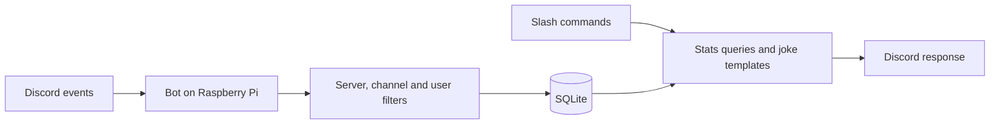

# Leland Tracker — behavior and design

The bot runs in one configured Discord server and tracks one configured user.
The current implementation and validation notes are in [REVIEW.md](REVIEW.md).

## Product

A Discord bot for a shared friend server that turns one user's server activity into
stats and lighthearted records. The target should know what the bot measures.
Tracker controls are limited to one configured owner and any number of optional
extra admin user IDs. Discord IDs identify the server, target, and admins; display
names can change. The owner can grant or revoke extra admins through private
commands without restarting the bot. Stored decisions override the optional
environment admin list, while the owner remains configured outside the database.

The bot counts message-create events, measures observed voice connection time,
reports activity and records, and makes short jokes from recorded statistics.
It also supports current presence checks, a direct-mention reply, configurable
upside-down text reposts, occasional emoji reactions, and an inverted copy of
the target's server avatar.
The tracking clock begins when the database is first initialized; collection
begins only after the bot connects, reconciles stored state, and is not paused.

## What to measure

| Feature | Definition | Status |
| --- | --- | --- |
| Messages | Message-create events by the target in configured text channels | Current |
| Active days | Local calendar days with a counted message or observed voice time | Current |
| Voice time and visits | Observed connection time and joins to configured voice channels | Current |
| Voice company | Observed time with other people in the same tracked voice channel, split equally among those present; time alone is separate | Current |
| Records | Most messages in a day; longest fully observed voice visit; top voice companion | Current |
| Game activity, quotes, scheduled recaps, phrase counts | Not implemented | Deferred ideas |

By default, the bot collects in all text and voice channels it can see. The
`TEXT_CHANNEL_IDS` and `VOICE_CHANNEL_IDS` settings can narrow collection.
“Text activity” means message events. `/leland online` requests current Discord
presence on demand and does not store presence history.

Voice time does not measure speaking. The server's AFK channel is excluded.
Moving between tracked voice channels continues a visit while splitting its channel
segments. Mute/deafen changes do not count as joins. Track mute time only if wanted later.
Voice company begins when this feature is enabled; earlier company cannot be
reconstructed. Bots are excluded. Each observed minute is split evenly among
the people present, so slices plus time alone sum to the observed, attributable
voice time. Each person's whole shared time is also stored, without the split,
for the leaderboard. Rows recorded before that change count their split share.
An outage ends attribution at the last reliable checkpoint.

Messages count when sent; edits and later deletion do not change the historical
message total. Message IDs, channel IDs, timestamps, and derived daily totals are
stored, but message bodies are not. The optional Evil Leland mode reads eligible
message text to repost it and does not save it. A direct bot mention uses mention
metadata to trigger a fixed reply. Data deletion removes tracked statistics and
managed local backups. It retains admin decisions as operational settings. A
database restore also restores the admin decisions in that backup; the configured
owner can correct them afterward.
Optional reaction mode uses only newly counted ordinary messages. Each reaction
is due after a randomly selected 15–25 such messages, then a new interval is
selected. It chooses either 😂 or 👸. The setting and remaining count are saved;
data deletion clears both. A failed Discord reaction is not retried.

## Commands

All commands run in the configured server; start with guild-scoped slash commands.

| Command | Result |
| --- | --- |
| `/leland stats period:week` | Messages, voice time, active days, observation start and gaps |
| `/leland records` | Personal records, dates, and measurement period |
| `/leland where` | Latest observed voice channel and time, including current voice presence |
| `/leland company period:week` | Pie chart of observed voice time attributed to people or time alone, limited to voice channels visible to the report audience |
| `/leland leaderboard period:all` | Ranked top 10 people by whole observed voice time shared with Leland (not split), with time alone listed but unranked; same channel visibility as company |
| `/leland trends period:last7 kind:daily` | Charts: per-day activity with streaks and ghost days, comparison with the previous period so far, time of day, day of week, company over time, or message bursts |
| `/leland online` | Current Discord status; idle and Do Not Disturb count as online |
| `/leland roast` | A short template joke using a real statistic |
| `/leland tldr period:week` | AI-cooked, playful summary of Leland's latest ≤40 messages from a local model, limited to channels visible to the report audience |
| `/leland help` | Commands and what the bot measures |
| `/leland about` | Bot version, connection health, enabled collectors, last checkpoint and gaps, last automatic update result |
| `/leland version` | Release number and deployed commit of the running bot |
| `/leland update` | Ask the Pi updater to check GitHub now instead of at the next 15-minute poll; configured tracker admins only |
| `/leland pause` | Stop collection; configured tracker admins only |
| `/leland resume` | Resume after a pause; configured tracker admins only |
| `/leland delete-data` | Configured tracker admins only; ephemeral confirmation, then erase data and pause collection |
| `/leland evil-mode mode:on/off` | Admin-only upside-down reposts of new Leland text messages |
| `/leland reaction-mode mode:on/off` | Admin-only occasional 😂 or 👸 reactions to new Leland messages |
| `/leland admin add user:@member` | Owner-only grant of tracker admin controls to a human server member |
| `/leland admin remove user_id:ID` | Owner-only revocation, including departed members; accepts an ID or mention |
| `/leland admin list` | Owner-only private list of the owner and effective admins with display name, username, and ID |

Periods: today, week (Monday through now), month, all time. `/leland trends`
also offers the last 7 days (local midnight six days ago through now), its default. The configured IANA
timezone is used for reports; timestamps are stored in UTC. The default is
`America/Costa_Rica`.

Example output, with illustrative numbers:

> **The Leland Report — this week**
> 183 messages · 8h 42m in voice · 5 active days
> Personal best: 2h 14m voice visit
> “Another 183 messages. The keyboard has requested PTO.”
> Tracking since September 26 · 12 minutes of missing coverage

Jokes use curated templates, avoid mass mentions, and have a shared cooldown.
No paid AI service is needed. Suppress all generated mentions by default.
If there is no data, say so instead of inventing a roast statistic.

`/leland trends` uses the same daily totals as `/leland stats` and starts no
earlier than the tracking start. Day-of-week averages and the active-day count
use only observed days: days with activity or finished days fully inside
coverage. Uncovered quiet days are left out rather than treated as quiet or
estimated. The comparison ends the previous window at the same local clock
time, so DST changes do not shift it. A ghost day must be a
finished local day fully inside collector coverage intervals; paused or
disconnected time makes a day unknown, not quiet. The previous-period
comparison, time of day, and bursts need message send times and voice
sessions, which exist only within the detail-retention window; the comparison
declines instead of mixing precise and day-rounded data, and the others state
when a period reaches past it. Company over time follows the company report's
channel visibility rules.

`/leland tldr` fetches the target's latest ≤40 message texts (within a
4,000-character prompt budget) from Discord on demand, only from channels and
public threads visible to the report audience (private threads are never read)
(requester for private replies, `@everyone` for public ones) where the bot can
also read message history. It sends them to a local model on the same machine
(`TLDR_MODEL_URL` must be a loopback address) and stores and logs neither the
text nor the summary. It only covers messages the tracker counted within the
period, so deleted tracker data is not re-read from Discord. It is off while
collection is paused, runs one request at a time, and has a shared cooldown.

## Architecture

The project uses Python, discord.py, SQLite, and systemd. It requires Python 3.11
or newer; the dependency pins were checked on Debian 13 with Python 3.13 on
aarch64.



Use one bot process with collectors, storage, queries, and commands in separate
modules. SQLite work is serialized on a worker thread. WAL mode and short
transactions are used, and the database stores a schema version.

The bot uses an outbound Gateway connection and receives command interactions
through it. This design needs no public website, inbound port, or port forwarding.

Current layout:

```text
src/flock_cctv/
  bot.py             # Startup and Discord client
  config.py          # Validated IDs, timezone, channel scope
  collectors.py      # Message and voice events
  storage.py         # Transactions and migrations
  stats.py           # Period boundaries, totals and records
  commands.py        # Slash commands and access checks
  jokes.py           # Templates
  avatar.py          # Avatar colour inversion
  evil.py            # Upside-down text and message splitting
  tldr.py            # TL;DR prompt, validation, formatting, local-model client
tests/
deploy/flock-cctv.service
deploy/flock-cctv-llm.service
.env.example
requirements.lock
pyproject.toml
```

## Data model

| Table | Main fields and purpose |
| --- | --- |
| `settings` | Guild/target IDs, fixed timezone, pause state, evil-mode state and checkpoints |
| `admin_overrides` | Owner-issued grant or revocation for a Discord user ID; overrides the environment list |
| `messages` | Unique message ID, channel, creation time and local day; no body |
| `voice_visits`, `voice_segments` | Visit bounds and observed channel segments/checkpoints |
| `voice_company_current`, `voice_company_daily` | Current channel/people and daily split and whole shared seconds by channel and person; member IDs only |
| `coverage_intervals`, `coverage_gaps` | Connection coverage and uncertain time |
| `daily_stats` | Message counts, voice seconds, visit counts and active-day flag |
| `records`, `last_voice` | Personal records and latest voice observation |

Discord IDs are stored as text. Message IDs are unique, so replayed events cannot
count twice while detailed message rows are retained. Daily aggregates and records
remain after message and closed-visit details age out. Detail retention defaults to
90 days and can be configured. The database is tied to its original server, target,
and timezone; changing `TIMEZONE` for an existing database is rejected because
historical daily totals are already grouped by that timezone.

## Accuracy and recovery

- Use message creation times. Split voice duration across local calendar boundaries.
- A live visit contributes through now only while the collector has reliable coverage.
- Persist open voice segments and checkpoint them every 60 seconds by default.
- After a crash, close stale segments at the last reliable checkpoint and flag them
  incomplete. Never count the entire downtime as connected voice time.
- On reconnect, reconcile current voice state. If Leland is already connected, start
  an observed segment at that point; his original join time is unknown.
- Let discord.py handle Gateway resume. Deduplicate replayed messages. Treat uncertain
  voice intervals conservatively; replayed state changes do not supply reliable historic
  transition timestamps. Keep a coverage gap when reconstruction is uncertain.
- Incomplete visits contribute observed duration but cannot win longest-visit records.
- A disconnect, guild-outage, or restart gap of at most two minutes (measured from
  the visit's last checkpoint to reconciliation) does not end a visit when
  reconciliation finds Leland in the same channel. The visit continues and keeps
  its original start; the gap remains a coverage gap and adds no voice time. A
  pause, a longer outage, or a different channel still splits the visit. Startup
  applies the same rule to retained visits recorded before this rule existed.
- Keep the latest voice channel and observation time after detailed segments expire.
  A public `/leland where` reply reveals its name only when the `@everyone` role
  can view that channel. A private reply reveals it only to a requester who can
  view it.
  Data deletion clears the observation.
- A company report includes only channels the requester can view when private,
  or the `@everyone` role can view when public. If a channel is unavailable or
  deleted, omit its attribution rather than exposing private activity.
- `/leland pause` closes active segments, disables collection and persists across restarts.
- Empty data, disabled collection and a disconnected bot are distinct response states.

## Discord configuration

Create a bot application, install it into one test server, and configure IDs locally.
Request only the permissions needed: View Channel in collection channels; Send
Messages wherever direct-mention replies or Evil Leland reposts should work; and
Embed Links in public report channels; and Read Message History only where
`/leland tldr` may summarize. No Administrator permission is needed.

Gateway intents: `GUILDS`, `GUILD_MESSAGES`, `GUILD_VOICE_STATES`, and privileged
`GUILD_PRESENCES` for the on-demand online command.
Message counts use event metadata. The direct-mention reply checks mention
metadata. Evil Leland mode reads message bodies for reposting and does not store
them, so it requires the privileged `MESSAGE_CONTENT` intent. Enable Presence and
Message Content intents in the portal.

General reports, including voice whereabouts, are public when called from a
configured public report channel; other channels receive ephemeral replies. The
legacy `OUTPUT_CHANNEL_ID` option restricts all commands to one channel. Online
status, `/leland about`, and controls always receive ephemeral replies. Runtime
checks enforce the configured guild and admin IDs.

## Running on the Pi

- Use a virtual environment and a dedicated systemd service that starts on boot and
  restarts on failure. Run one instance as an unprivileged account.
- Keep the token in a restricted environment file outside Git. Keep database files,
  backups and logs out of Git too. Never log tokens or full Discord event payloads.
- Use the systemd journal for service logs. Avoid logging each message.
- Back up SQLite daily using its backup API; retain seven daily backups and test restore.
- Data deletion removes tracked details, summaries, records, and managed local
  backups so those backups cannot restore deleted statistics.
- Graceful shutdown flushes writes and closes segments. Check free disk space and
  synchronized system time; surface collection/storage errors in health status.
- Deploy by installing pinned dependencies, running migrations, restarting the service,
  and checking a command plus logs. Take a database backup before schema changes.
- An optional Pi-side systemd timer polls the Git remote default branch every 15
  minutes over SSH with a read-only deploy key. Root only fetches and swaps code;
  the unprivileged service account installs dependencies and runs tests before
  the bot stops. It backs up SQLite after shutdown, then swaps the install. The
  new bot must report a Discord connection before activation is accepted. A
  stable recovery helper checks a pending record before the bot starts,
  including after a power loss. Failed activation restores the previous code and
  database, but never restores data deleted during activation. A failing commit
  waits six hours before a retry. The updater's last result appears in
  `/leland about`, and the owner gets one DM per failure streak. An operator
  can deploy and hold an older commit. `/leland update` lets tracker admins
  start a check early: the bot only writes a request file, and a systemd path
  unit starts the same root-run updater, so the bot gains no privileges. Runtime data and credentials stay outside
  `/opt`.

## Technical references

- [Discord Gateway and intents](https://docs.discord.com/developers/events/gateway)
- [Discord events, voice state and presence](https://docs.discord.com/developers/events/gateway-events)
- [Application commands](https://docs.discord.com/developers/docs/interactions/slash-commands)
- [discord.py introduction](https://discordpy.readthedocs.io/en/stable/intro.html)
